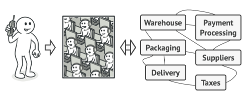

# Facade
Facade is a structural design pattern that provides a simplified interface to a library, a framework, or any other complex set of classes.
## Real-World Analogy

An example of taking a phone order

When you call a shop to place a phone order, an operator is your facade to all services and departments of the shop. The operator provides you with a simple voice interface to the ordering system, payment gateways, and various delivery services.

MIT Licensed

**Copyright © 2023-present Vasyl Hulpak**
