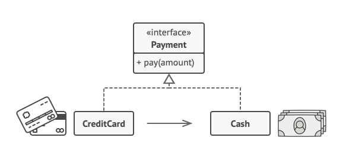

# Proxy
Proxy is a structural design pattern that lets you provide a substitute or placeholder for another object. A proxy controls access to the original object, allowing you to perform something either before or after the request gets through to the original object.


 Credit cards can be used for payments just the same as cash.

A credit card is a proxy for a bank account, which is a proxy for a bundle of cash. Both implement the same interface: they can be used for making a payment. A consumer feels great because there’s no need to carry loads of cash around. A shop owner is also happy since the income from a transaction gets added electronically to the shop’s bank account without the risk of losing the deposit or getting robbed on the way to the bank.


```csharp
public interface ISubject
{
    void Request();
}

class RealSubject : ISubject
{
    public void Request()
    {
        Console.WriteLine("RealSubject: Handling Request.");
    }
}

class Proxy : ISubject
{
    private RealSubject _realSubject;
    
    public Proxy(RealSubject realSubject)
    {
        _realSubject = realSubject;
    }
    
    public void Request()
    {
        if (CheckAccess())
        {
            _realSubject.Request();

            LogAccess();
        }
    }
    
    public bool CheckAccess()
    {
        Console.WriteLine("Proxy: Checking access prior to firing a real request.");

        return true;
    }
    
    public void LogAccess()
    {
        Console.WriteLine("Proxy: Logging the time of request.");
    }
}

public class Client
{
    public void ClientCode(ISubject subject)
    {
        // ... Before
        
        subject.Request();
        
        // ... After
    }
}
```

MIT Licensed

**Copyright © 2023-present Vasyl Hulpak**
